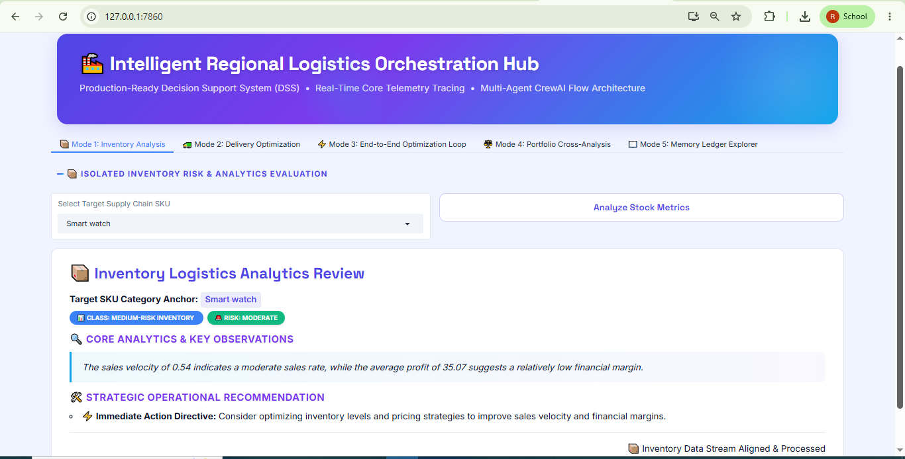
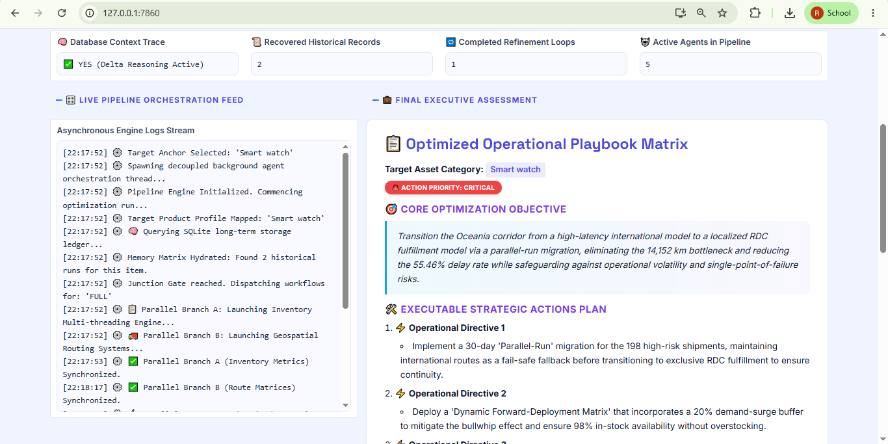
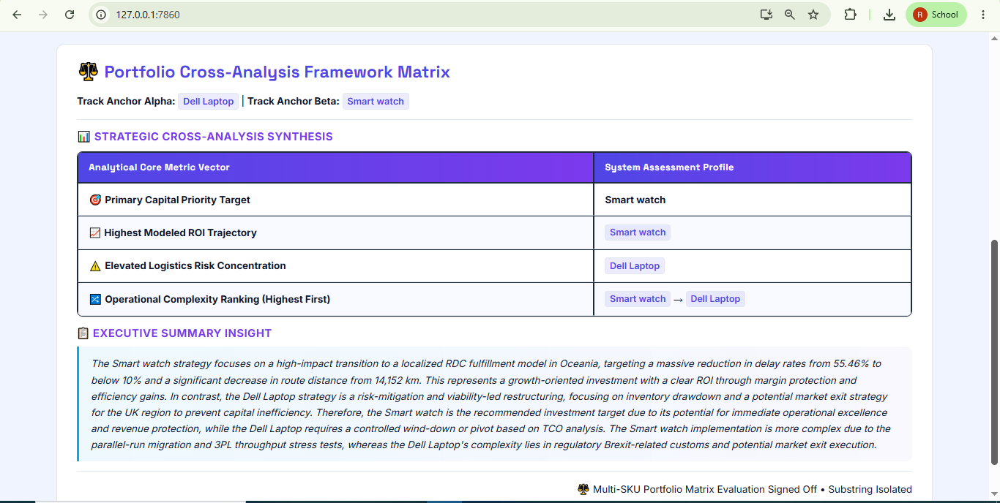
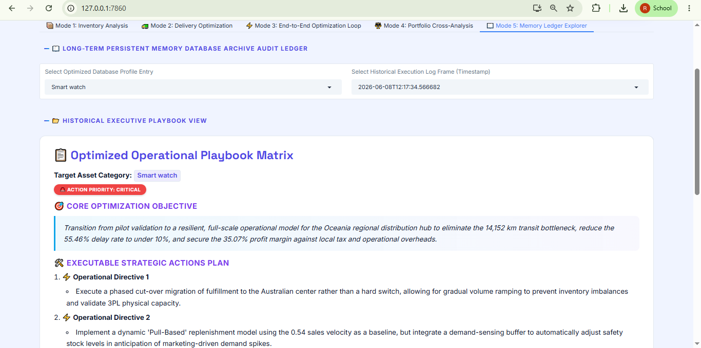
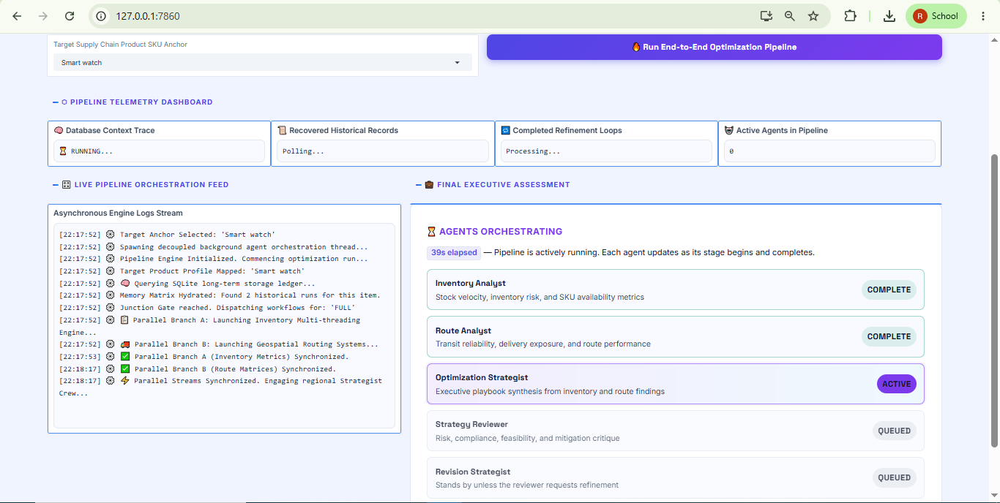
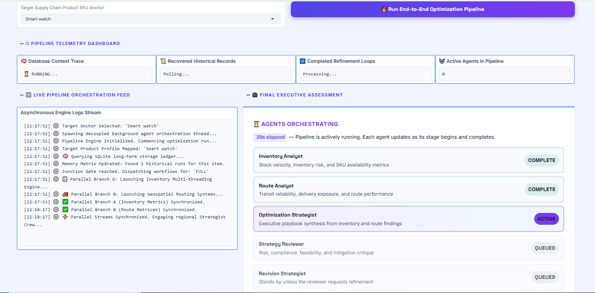
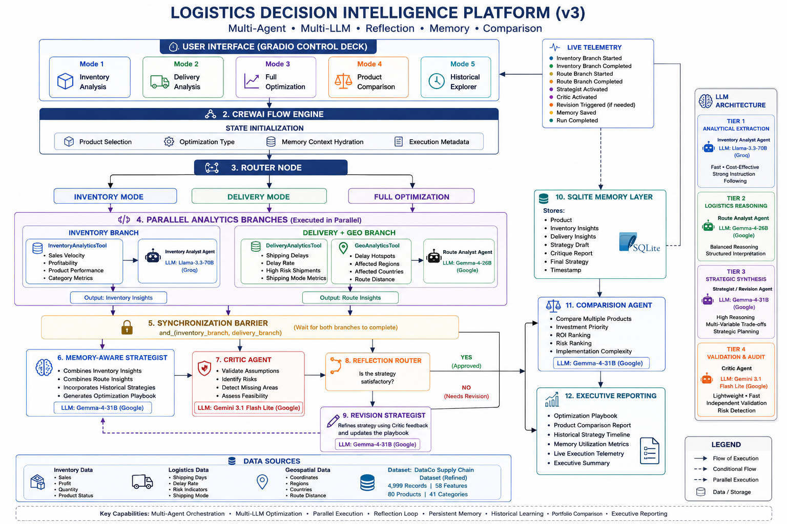

# 🚚 Logistics Decision Intelligence Platform

[](https://www.python.org/)
[](https://docs.crewai.com/concepts/flows)
[](https://www.sqlite.org/)
[](https://aistudio.google.com/)
[](https://www.kaggle.com/)

> A **CrewAI Flow-based Multi-Agent Logistics Intelligence Platform** — combining parallel analytics execution, Strategist–Critic–Revision reflection loops, persistent SQLite memory with delta reasoning, multi-LLM cognitive specialization, and portfolio-level product comparison into a single decision-support system grounded in real supply chain data.

---

## 📸 Screenshots

### Main Dashboard — Gradio Control Deck



> *Five-mode Gradio interface — Inventory Analysis, Delivery Analysis, Full Optimization, Product Comparison, and Historical Strategy Explorer.*

---

### Full Optimization Output — Strategy Playbook



> *Structured optimization playbook generated by the Strategist crew after parallel inventory and delivery branch synchronization.*

---

### Product Comparison Engine



> *Portfolio-level comparison across multiple products — investment priority ranking, ROI estimates, logistics risk scores, and operational complexity.*

---

### Historical Strategy Explorer



> *SQLite-backed historical strategy timeline per product — enabling memory-aware delta reasoning across optimization runs.*

---

### Live Execution Telemetry



> *Thread-safe EventLogger streaming real-time pipeline stage events — branch activations, critic decisions, revision triggers, and memory persistence confirmations.*

---

### 🎬 Demo Video

[](https://youtu.be/DOV3WcW3IqI)

> *Click the thumbnail above to watch a full walkthrough of the agentic workflow.*

---

## 🏗️ Architecture



> *Flow-Oriented Multi-Agent Architecture — CrewAI Flow engine with a Router Gate, parallel analytics branches, synchronization barrier, Strategist–Critic–Revision loop, SQLite memory layer, and Gradio dashboard.*

### High-Level Workflow

```
User Input (Product + Optimization Mode)
            │
            ▼
   [CrewAI Flow Engine — LogisticsFlow]
            │
            ▼
  ┌──────────────────────────────┐
  │    State Initialization      │  ← Pydantic LogisticsState hydrated
  │    + Memory Context Load     │    SQLite history injected for delta reasoning
  └────────────┬─────────────────┘
               │
               ▼
  ┌──────────────────────────────┐
  │       Router Node            │  ← Routes: "inventory" / "delivery" / "full"
  └────────────┬─────────────────┘
               │
       ┌───────┼────────┐
       │       │        │
  INVENTORY  DELIVERY  FULL
       │       │        │
       │       │   ┌────┴────────────────┐
       │       │   │  Parallel Branch A  │  ← Inventory Analytics (Groq Llama-3.3-70B)
       │       │   │  Parallel Branch B  │  ← Delivery + Geo Analytics (Gemma-4-26B)
       │       │   └────────┬────────────┘
       │       │            │
       │       │   ┌────────┴────────────┐
       │       │   │  Sync Barrier       │  ← and_(inventory_branch, delivery_branch)
       │       │   └────────┬────────────┘
       │       │            │
       └───────┴────────────┤
                            ▼
  ┌──────────────────────────────┐
  │   Memory-Aware Strategist    │  ← Gemma-4-31B synthesizes insights
  │   Crew                       │    + injects historical context
  └────────────┬─────────────────┘
               │
               ▼
  ┌──────────────────────────────┐
  │     Critic Agent Crew        │  ← Gemini 3.1 Flash Lite audits strategy
  └────────────┬─────────────────┘
               │
               ▼
  ┌──────────────────────────────┐
  │     Reflection Router        │  ← APPROVED → Finalize
  └────────────┬─────────────────┘    REVISE → Revision Loop
               │
       ┌───────┴──────────┐
   APPROVED            REVISE
       │                  │
       ▼                  ▼
  ┌──────────┐    ┌────────────────┐
  │ Complete │    │ Revision Agent │  ← Gemma-4-31B hardens playbook
  └────┬─────┘    └──────┬─────────┘
       │                 │
       └────────┬─────────┘
                │
                ▼
  ┌──────────────────────────────┐
  │    SQLite Memory Layer       │  ← Final strategy persisted for future runs
  └──────────────────────────────┘
                │
                ▼
       Gradio Dashboard
       ├── Mode 1 — Inventory Analysis
       ├── Mode 2 — Delivery Analysis
       ├── Mode 3 — Full Optimization
       ├── Mode 4 — Product Comparison
       └── Mode 5 — Historical Strategy Explorer
```

---

## ✨ Features

- **CrewAI Flow orchestration** — the entire pipeline is managed by a `LogisticsFlow(Flow[LogisticsState])` with `@start`, `@router`, `@listen`, and `@listen(and_(...))` decorators; no ad-hoc control flow
- **Parallel analytics execution** — Inventory and Delivery+Geo branches run concurrently in Full Mode; a synchronization barrier (`and_`) gates the Strategy stage until both resolve
- **Strategist–Critic–Revision reflection loop** — every generated strategy is audited by an independent Critic agent; the Reflection Router conditionally triggers the Revision agent or fast-tracks to finalization
- **Persistent SQLite memory with delta reasoning** — historical strategies are retrieved per product at initialization and injected into the Strategist prompt, enabling the system to build upon prior decisions rather than re-deriving from scratch
- **Multi-LLM cognitive architecture** — four specialized language models aligned to task complexity: Groq Llama-3.3-70B for inventory analysis, Gemma-4-26B for route reasoning, Gemma-4-31B for strategy synthesis and revision, and Gemini 3.1 Flash Lite for fast independent validation
- **Three custom analytics engines** — `InventoryAnalyticsTool`, `DeliveryAnalyticsTool`, and `GeoAnalyticsTool` transform raw CSV records into structured intelligence before any agent reasoning begins
- **Portfolio comparison engine** — a dedicated Comparison Agent evaluates multiple products simultaneously and ranks by investment priority, logistics risk, expected ROI, and implementation complexity
- **Pydantic-structured state** — the `LogisticsState` object enforces typed fields across all pipeline stages, eliminating unstructured dictionary passing
- **Live execution telemetry** — a thread-safe `EventLogger` streams pipeline events to the Gradio UI in real time, surfacing branch activations, critic verdicts, revision triggers, and memory saves
- **Five-mode Gradio dashboard** — isolated Inventory, isolated Delivery, Full Optimization, Product Comparison, and Historical Strategy Explorer, each with tailored output formatting

---

## 🧠 Multi-LLM Cognitive Architecture

| Tier | Model | Responsibilities |
|---|---|---|
| Tier 1 — Inventory Analysis | Groq Llama-3.3-70B-Versatile | Sales velocity, profitability analysis, product classification, inventory risk |
| Tier 2 — Logistics Reasoning | Gemma-4-26B-A4B-IT | Delay analysis, geospatial bottleneck identification, delivery risk assessment |
| Tier 3 — Strategy Synthesis | Gemma-4-31B-IT | Insight synthesis, optimization playbook generation, historical delta reasoning, revision |
| Tier 4 — Validation & Audit | Gemini 3.1 Flash Lite | Independent critique, assumption validation, risk identification, feasibility assessment |

Each model handles the cognitive workload it is best suited for, controlling both quality and token cost.

---

## ⚙️ Tech Stack

| Component | Technology |
|---|---|
| Frontend | Gradio |
| Flow Orchestration | CrewAI Flow (`@start`, `@router`, `@listen`, `and_`) |
| Agent Framework | CrewAI |
| LLM Providers | Groq (Llama-3.3-70B), Google (Gemma-4-26B, Gemma-4-31B, Gemini Flash Lite) |
| Persistent Memory | SQLite (`StrategyMemory`) |
| State Management | Pydantic (`LogisticsState`) |
| Analytics Layer | Custom Python tools (Inventory, Delivery, Geo) |
| Dataset | DataCo Supply Chain Geospatial Dataset (5,000 records, 58 features) |
| Output Normalization | `normalize_output` utility (dict/string unification) |
| Execution Telemetry | Thread-safe `EventLogger` |
| Data Processing | Pandas |
| Language | Python 3.10+ |

---

## 📁 Project Structure

```
logistics_decision_platform/
│
├── gradio_app.py               # Gradio dashboard — 5 modes, formatters, telemetry feed
├── logistics_flow.py           # CrewAI Flow definition — all stages, routing, sync logic
│
├── models/
│   └── state.py                # Pydantic LogisticsState — typed shared pipeline state
│
├── crews/
│   ├── inventory_crew.py       # Inventory Analyst crew (Groq Llama-3.3-70B)
│   ├── route_crew.py           # Route Analyst crew (Gemma-4-26B)
│   ├── strategy_crew.py        # Optimization Strategist crew (Gemma-4-31B)
│   ├── critique_crew.py        # Critic Agent crew (Gemini Flash Lite)
│   ├── revision_crew.py        # Revision Agent crew (Gemma-4-31B)
│   └── comparison_crew.py      # Portfolio Comparison Agent crew
│
├── tools/
│   ├── inventory_tool.py       # InventoryAnalyticsTool — sales, profit, velocity metrics
│   ├── delivery_tool.py        # DeliveryAnalyticsTool — delay rate, shipping performance
│   └── geo_tool.py             # GeoAnalyticsTool — hotspots, regions, route distance
│
├── memory/
│   └── strategy_store.py       # SQLite StrategyMemory — save/retrieve optimization history
│
├── services/
│   └── product_catalog.py      # ProductCatalog — product discovery from dataset
│
├── utils/
│   ├── normalize_output.py     # Dict/string output unification utility
│   └── event_logger.py         # Thread-safe live telemetry logger
│
├── data/
│   └── DataCoSupplyChainDatasetRefined_First_5000.csv
│
├── .env                        # API keys (not committed)
├── requirements.txt
└── README.md
```

---

## 🚀 Getting Started

### 1. Clone the repository

```bash
git clone https://github.com/ruthuraraj-ml/logistics-decision-intelligence.git
cd logistics-decision-intelligence
```

### 2. Create and activate a virtual environment

```bash
python -m venv venv

# Windows
venv\Scripts\activate

# macOS / Linux
source venv/bin/activate
```

### 3. Install dependencies

```bash
pip install -r requirements.txt
```

### 4. Set up environment variables

Create a `.env` file in the project root:

```env
GROQ_API_KEY=your_groq_api_key_here
GOOGLE_API_KEY=your_google_api_key_here
```

### 5. Run the Gradio app

```bash
python gradio_app.py
```

Open [http://localhost:7860](http://localhost:7860) in your browser.

---

## 🔑 Getting API Keys

| Service | Free Tier | Link |
|---|---|---|
| Groq | Yes (generous rate limits) | [console.groq.com](https://console.groq.com) |
| Google AI Studio (Gemini / Gemma) | Yes | [aistudio.google.com](https://aistudio.google.com) |

---

## 🔄 How the Reflection Loop Works

The Strategist–Critic–Revision loop is the core quality mechanism of the platform. Unlike single-pass generation:

1. **Strategy Draft** — the Strategist crew synthesizes inventory insights, delivery insights, and historical memory context into an optimization playbook.
2. **Critic Audit** — an independent Critic Agent (Gemini Flash Lite) evaluates the strategy for strengths, weaknesses, unsupported assumptions, missing considerations, and operational risk exposure.
3. **Reflection Router** — the router reads `approval_status` from the Critic output. If `APPROVED`, the workflow fast-tracks to the Complete stage. If `REVISE`, the Revision agent is activated.
4. **Revision** — the Revision Agent refines the playbook using targeted Critic feedback, producing a hardened final strategy.
5. **Memory persistence** — whether approved or revised, the final strategy is stored to SQLite for future delta reasoning.

This ensures every recommendation delivered to the user has been independently validated before finalization.

---

## 🧠 How Persistent Memory and Delta Reasoning Work

At pipeline initialization, the system queries the SQLite memory layer for all historical optimization runs matching the selected product. These are formatted and injected into the Strategist prompt as context.

This enables the Strategist to:
- Build upon successful recommendations from prior runs rather than repeating them
- Identify what has already been tried and avoid redundant suggestions
- Adapt recommendations when conditions have changed since the last analysis

The system transitions from a stateless optimizer into a **context-aware decision support platform** that accumulates organizational knowledge over time.

---

## 📊 Dashboard Modes

### Mode 1 — Inventory Analysis
Runs the Inventory Analytics Tool and Inventory Analyst crew in isolation. Outputs inventory classification, risk level, key observations, and a targeted reorder recommendation.

### Mode 2 — Delivery Analysis
Runs the Delivery and Geo Analytics Tools and Route Analyst crew in isolation. Outputs delay rates, high-risk shipment counts, geospatial hotspots, and routing recommendations.

### Mode 3 — Full Optimization
Activates the complete parallel pipeline — both analytics branches run concurrently, synchronize at the strategy stage, and pass through the full Strategist–Critic–Revision reflection loop. Outputs a final optimization playbook.

### Mode 4 — Product Comparison
Accepts multiple product names and runs the Comparison Agent. Outputs an investment priority ranking, highest-risk product identification, expected ROI estimates, and implementation complexity scores.

### Mode 5 — Historical Strategy Explorer
Queries the SQLite memory layer and displays all previous optimization runs for any selected product, presented as a timestamped strategy timeline.

---

## 🗄️ Dataset

**Source:** DataCo Supply Chain Geospatial Dataset (Refined) — Kaggle

| Attribute | Value |
|---|---|
| Records | 5,000 (first 5,000 rows) |
| Features | 58 attributes |
| Unique Products | 80 |
| Product Categories | 41 |

Key feature groups used: `product_price`, `order_item_quantity`, `order_profit_per_order`, `days_for_shipping_real`, `late_delivery_risk`, `shipping_mode`, `latitude_src/dest`, `longitude_src/dest`, `order_region`, `order_country`.

---

## 🔮 Planned Enhancements

- [ ] Real-time ERP system integration via API connectors
- [ ] Predictive demand forecasting layer using time-series models
- [ ] GraphRAG-based supply chain knowledge graph for supplier relationship reasoning
- [ ] Autonomous optimization execution pipelines (beyond recommendation generation)
- [ ] Multi-turn conversational interface over stored optimization history
- [ ] Structured tracing with Langfuse or OpenTelemetry for production observability
- [ ] Expanded dataset support (full 180K+ record DataCo dataset)

---

## 🎯 What This Project Demonstrates

- **CrewAI Flow design** — full use of `@start`, `@router`, `@listen`, `@listen(and_(...))` decorators; synchronization barriers; conditional routing based on Pydantic state
- **Parallel multi-agent execution** — two independent analytics crews run concurrently in Full Mode and synchronize before strategic synthesis
- **Reflection-driven quality control** — independent Critic Agent audit with a conditional Revision loop, not a single-pass generation pipeline
- **Persistent organizational memory** — SQLite strategy store enabling cross-run delta reasoning and accumulating decision history per product
- **Multi-LLM cognitive specialization** — four different models assigned to four distinct cognitive tiers, balancing reasoning quality against token cost
- **Production-grade modular architecture** — each concern (analytics tools, crews, memory, state, telemetry, UI) is an isolated module with a clear single responsibility
- **Real-world dataset grounding** — all analysis runs against the public DataCo Supply Chain Dataset, not synthetic inputs

---

## 📜 License

This project is intended for educational and portfolio purposes.
